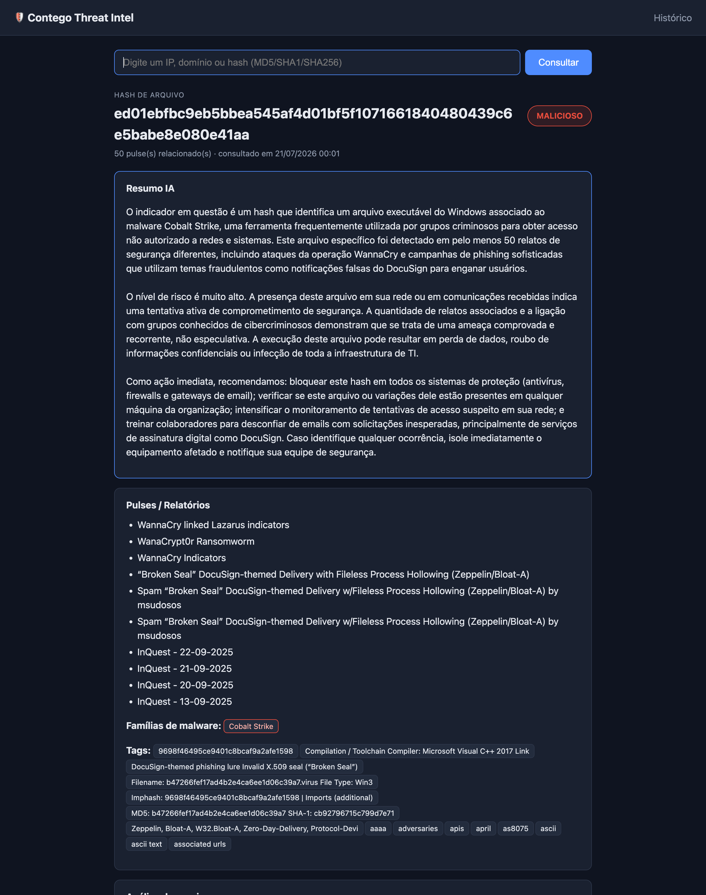
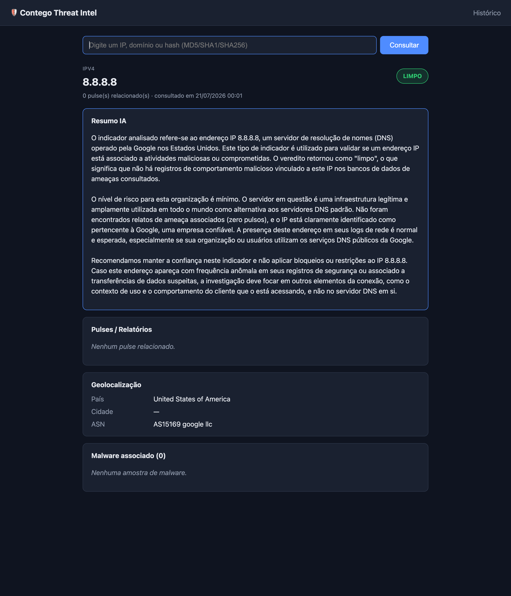
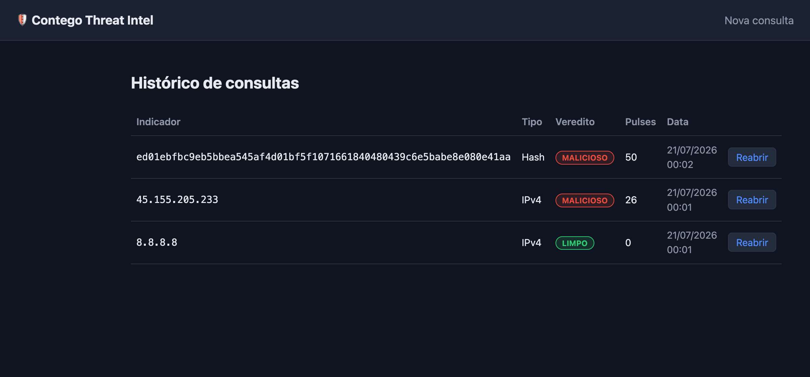
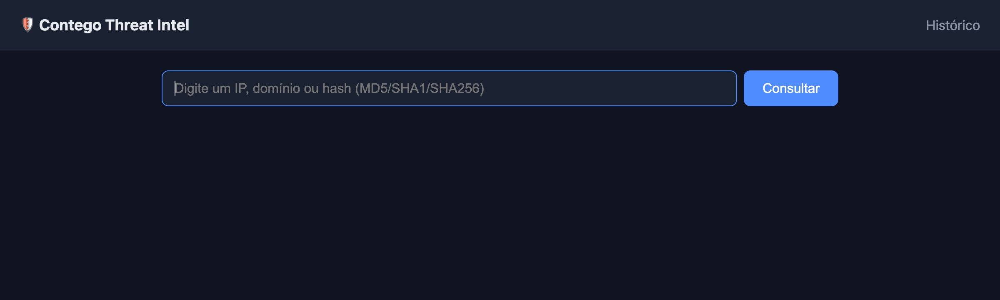

# Contego Threat Intel

Plataforma web simples de **Threat Intelligence** para consulta de indicadores de
ameaça (IOCs). O usuário informa um **IP**, **domínio** ou **hash de arquivo**, e a
aplicação consulta a API do [AlienVault OTX](https://otx.alienvault.com/), organiza os
dados de reputação/ameaça num dashboard legível, guarda um histórico local e — como
diferencial — gera um resumo em linguagem natural (PT-BR) via **Claude API**, no formato
de um briefing para o cliente.

> Projeto desenvolvido como desafio técnico de estágio na **Contego Security**.

## Stack

- **Backend:** Python + [FastAPI](https://fastapi.tiangolo.com/)
- **Frontend:** HTML/CSS/JS com templates Jinja2 (sem frameworks JS)
- **Banco:** SQLite (histórico de consultas)
- **APIs externas:**
  - [AlienVault OTX](https://otx.alienvault.com/) — dados de ameaça/reputação
  - [Anthropic Claude](https://www.anthropic.com/) — resumo em linguagem natural (opcional)

## Funcionalidades

- Input único: digite um IP, domínio ou hash — o tipo é **detectado automaticamente** por regex.
- Consulta ao OTX conforme o tipo e montagem de um objeto limpo (sem JSON cru na tela).
- Dashboard com **veredito colorido** (limpo / suspeito / malicioso) derivado do nº de pulses.
- Detalhes por tipo: pulses relacionados, geolocalização (IP/domínio), malware e URLs
  associadas, análise de arquivo (hash).
- **Histórico** persistido em SQLite, com link para reabrir cada consulta.
- **Resumo IA** (diferencial, opcional): briefing de 2-3 parágrafos em PT-BR via Claude.

## Demonstração

Consulta de um **hash malicioso** (WannaCry) — veredito, pulses relacionados e o
**Resumo IA** gerado em linguagem natural para um cliente não técnico:



Consulta de um **IP limpo** (8.8.8.8) — veredito verde, resumo e geolocalização:



**Histórico** das consultas anteriores, com link para reabrir cada resultado:



Tela inicial:



## Como obter as chaves de API

### AlienVault OTX (obrigatória)

1. Crie uma conta gratuita em <https://otx.alienvault.com/>.
2. Acesse **Settings → API Integration**.
3. Copie a sua **OTX API Key**.

### Anthropic Claude (opcional)

O resumo em linguagem natural é um diferencial **opcional**: sem essa chave, a aplicação
funciona normalmente, apenas sem a seção "Resumo IA".

1. Crie uma conta em <https://console.anthropic.com/>.
2. Em **API Keys**, gere uma nova chave.
3. Adicione um método de pagamento (o uso é cobrado por tokens; o resumo usa um modelo
   barato — custo da ordem de centavos por consulta).

## Como rodar localmente

Pré-requisito: **Python 3.10+**.

```bash
# 1. Clonar o repositório
git clone https://github.com/arthurcamargo03/contego-threat-intel.git
cd contego-threat-intel

# 2. Criar e ativar um ambiente virtual
python3 -m venv venv
source venv/bin/activate        # Windows: venv\Scripts\activate

# 3. Instalar as dependências (versões fixadas em requirements.txt)
pip install -r requirements.txt

# 4. Configurar as variáveis de ambiente
cp .env.example .env
# Abra o .env e preencha OTX_API_KEY (e, se quiser o resumo, ANTHROPIC_API_KEY)

# 5. Rodar o servidor
uvicorn main:app --reload
```

Acesse <http://127.0.0.1:8000> no navegador.

### Variáveis de ambiente (`.env`)

| Variável            | Obrigatória | Descrição                                                        |
| ------------------- | :---------: | ---------------------------------------------------------------- |
| `OTX_API_KEY`       |     Sim     | Chave da API do AlienVault OTX.                                  |
| `ANTHROPIC_API_KEY` |     Não     | Chave da Claude API. Se ausente, o resumo IA fica desativado.    |
| `ANTHROPIC_MODEL`   |     Não     | Modelo do resumo (default: `claude-haiku-4-5`).                  |
| `DATABASE_PATH`     |     Não     | Caminho do arquivo SQLite (default: `threat_intel.db`).          |

> O `.env` está no `.gitignore` e **nunca** é versionado — as chaves reais não vão pro git.
> O `.env.example` documenta os nomes das variáveis, sem valores.

## Estrutura de pastas

```
contego-threat-intel/
├── main.py               # App FastAPI: rotas e orquestração (camada de apresentação)
├── services/
│   ├── otx.py            # Consulta ao OTX: detecção de tipo + montagem do objeto limpo
│   └── ai.py             # Resumo em linguagem natural via Claude (opcional/degradável)
├── database/
│   └── db.py             # Camada de acesso ao SQLite (isolada do resto da app)
├── templates/
│   ├── index.html        # Formulário + dashboard do resultado
│   └── history.html      # Lista do histórico de consultas
├── static/
│   └── style.css         # Estilos (tema escuro; veredito em semáforo)
├── .env.example          # Nomes das variáveis de ambiente (sem valores)
├── .gitignore            # Ignora .env, *.db, __pycache__, venv/
├── requirements.txt      # Dependências com versões fixadas
└── README.md
```

A separação em camadas é intencional: as **rotas** (`main.py`) só orquestram; a **regra de
negócio** vive nos `services/`; e todo **acesso ao banco** fica isolado em `database/db.py`.
Isso deixa cada parte testável e fácil de trocar (ex: trocar SQLite por outro banco mexe
só no `db.py`).

## Fluxo da aplicação

1. O usuário digita um indicador em `/` e envia o formulário (`POST /`).
2. `services/otx.py` **detecta o tipo** (IPv4, domínio ou hash) via regex.
3. Consulta os endpoints certos do OTX e monta um **objeto limpo** com os dados relevantes.
4. O nº de pulses vira o **veredito**: `0 = limpo`, `1-3 = suspeito`, `4+ = malicioso`.
5. Se houver `ANTHROPIC_API_KEY`, `services/ai.py` gera um **resumo em PT-BR**; senão, `None`.
6. A consulta é salva no **histórico** (`database/db.py`) e o **dashboard** é renderizado.
7. Em `/history`, o usuário vê as consultas anteriores e pode **reabrir** cada resultado —
   direto do banco, sem reconsultar o OTX.

## Tratamento de erros

Os erros são traduzidos em mensagens amigáveis na própria página, sem vazar stack trace:

- **Indicador inválido** (formato não reconhecido) → orienta o formato esperado.
- **Não encontrado no OTX** (404) → mensagem clara.
- **API fora do ar / timeout / rate limit** → mensagem amigável, sem quebrar a app.
- **Falha no resumo IA** → degrada silenciosamente (a consulta ao OTX não é afetada).
